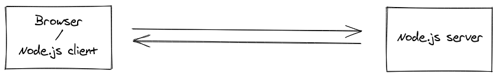
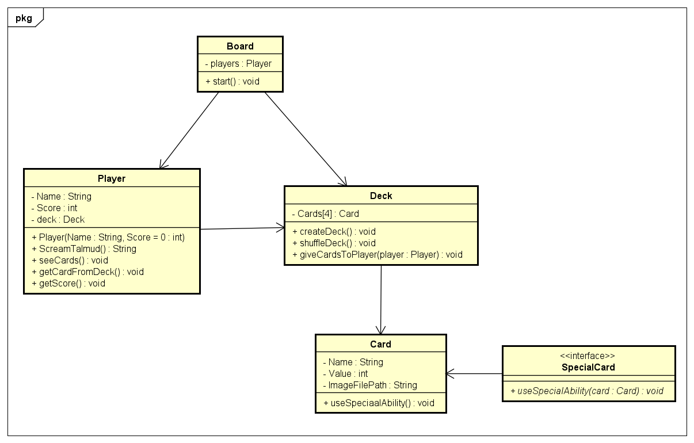

# Start document Talmud

## Version history
| Revision      | Changes     | Date  |
| ------------- |:-------------:| -----:|
|1.0            |Starting version|12/05/2021|
|1.5            |Added Test cases and changed Class diagram after feedback|17/05/2021|

## Description of assignment

Talmud is a card game where between 2 or 4 players play to get as less points as possible. Players get 4 cards and can only see 2 out of the 4 cards at the start of the game. The goal is to change the cards of higher value to cards which have a lower value and reach less than 5.

Only 2 of the 4 cards are visible. Higher numbers on the deck such as 10,11 and 12 (Jota, caballo and Rey) have different special abilities. In this case, 10 gives you the ability to see another of your cards. Card number 11 can change one of the cards from your deck with another player’s card without seeing what the value of the card is. Card number 12 does the same function as card 11 but with the ability to see the other players card and if the player wants to change the card, he can change it.

In the table, there are 2 deck of cards. One of the decks being the used cards by the players and another one which is the cards which still have not been used by the players. Every round, the players can change 1 of their 4 cards by a card in either of the 2 decks. The card changed by the player, will go into the used cards deck.

If a player has the same number card as the one at the top in the used cards deck, the player can leave his card in the used cards deck as well. This meaning that he has 3 cards to play now with.

To win, you need to score less than 5 points with all your cards. When it is a player turn, he needs to scream “Talmud!”. When this happens, one more round is played. The player who screamed “Talmud!”, gets -5 points meanwhile the other players add up the score of each card.

A player is eliminated when the player gets over 20 points

## JavaScript libraries used:

Socket.io will be used for the back-end part of the game as it is a library that enables real-time, bidirectional, and event-based communication between the browser and the server. **[1]**

Socket.io works with Node.js as Node.js has implemented a Node.js client which can manage Socket.io calls. This means that we will also use Node.js framework as well as Socket.io for the backend of the application. **[3]**

Regarding the frontend, jQuery will be used as it has a lot of functionalities which will make a user-friendly environment. jQuery will be used in specific things such as the animation of the cards. **[4]**

**To check the references please refer to the chapter: Bibliography**

## Selling point of application.

As an application, “Talmud” stands out since it is an innovative game that has never seen online. It is a well-known card game in Spain, but it has never been seen outside the country. As the application will be a multiplayer game, a maximum of 4 people can play around the same server. This means that with the recent Covid pandemic people can still play the game without being in danger due to Covid. **[2]**

It is also a card game which is very enjoyable and easy to play. This means that with the friendly user-interface the application will have, anyone who wants to play can play as it will be an online game.
As a general fact making the application online, will have a great impact on the sales as this will make the application available to all the users which are interested in the game.

**To check the references please refer to the chapter: Bibliography**

## Class diagram ## 

## Test plan

The test plan, will be done with a fix scenario as in the real game, all the scenarios possible may be random.
In this test cases we will only play with the 2 cards that we know the value as only 2 out of the 4 cards are visible at the start of the game.

The Following object are created before every test case

| Object type   | Object name   | Score    |value|Cards[4]|Method|
| ------------- |:-------------:|----------|-----|--------|-----:|
|Player         |Pepe           |0         |     |        |      |    
|Player         |Gerjan         |0         |     |        |      |
|Card           |Oro            |          |1    |        |      |
|Card           |Espada         |          |1    |        |      |
|Card           |Baston         |          |3    |        |      |
|Card           |Copa           |          |5    |        |      |
|Card           |Oro            |          |11   |        |      |
|Card           |Espada         |          |10   |        |      |
|Card           |Baston         |          |12   |        |      |
|Card           |Copa           |          |4    |        |      |
|Deck           |deck           |          |     |random(Card)|  |
|Deck           |deck2          |          |     |random(Card)|  |
|Deck           |deck           |          |     |        |giveCardsToPlayer(Pepe)|
|Deck           |deck2          |          |     |        |giveCardsToPlayer(Gerjan)|

## Test case 1
In this test case the players find card number 10 which has a special ability and they can see one more of their cards. Remeber that from the start of the game, only 2 of the 4 cards are visible.

| Object type   | Object name   | Score    |value|Cards[4]|Method|Output|
| ------------- |:-------------:|----------|-----|--------|------|-----:|
|Player         |Pepe           |0         |     |        |      |      |
|Player         |Pepe           |0         |     |        |seeCards()| 1 Oro, 3 Baston|  
|Player         |Pepe           |0         |     |        |getCardFromDeck()|10 Espada|     
|Player         |Gerjan         |0         |     |        |      |      |
|Card           |Espada         |          |10   |        |UseSpecialAbility(Pepe)|
|Player         |Pepe           |0         |     |        |seeCards()| 1 Oro, 3 Baston, 4 Copa|

## Test case 2
In this test case the players find card number 11 which has a special ability where one of the players changes a card from the others deck without looking at it. Remeber that from the start of the game, only 2 of the 4 cards are visible.

| Object type   | Object name   | Score    |value|Cards[4]|Method|Output|
| ------------- |:-------------:|----------|-----|--------|------|-----:|
|Player         |Pepe           |0         |     |        |      |      |
|Player         |Pepe           |0         |     |        |seeCards()| 1 Oro, 3 Baston| 
|Player         |Gerjan         |0         |     |        |seeCards()| 5 Copa, 4 Copa|   
|Player         |Pepe           |0         |     |        |getCardFromDeck()|11 Oro|     
|Player         |Gerjan         |0         |     |        |      |      |
|Card           |Oro            |          |11   |        |UseSpecialAbility(Pepe)|
|Player         |Pepe           |0         |     |        |seeCards()| 1 Oro, 4 Copa|
|Player         |Gerjan         |0         |     |        |seeCards()| 5 Copa, 3 Baston|

## Test case 3
In this test case the players find card number 12 which has a special ability where one of the players changes a card from the others deck looking at it. If the player is interested he will change it. If that is not the case, the player will .Remeber that from the start of the game, only 2 of the 3 cards are visible. In this case, Pepe gets card 12 Baston but will not use it. Gerjan gets another 12 and will use it.

| Object type   | Object name   | Score    |value|Cards[4]|Method|Output| 
| ------------- |:-------------:|----------|-----|--------|------|-----:|
|Player         |Pepe           |0         |     |        |      |      |
|Player         |Pepe           |0         |     |        |seeCards()| 1 Oro, 3 Baston|
|Player         |Gerjan         |0         |     |        |seeCards()| 5 Copa, 4 Copa|   
|Player         |Pepe           |0         |     |        |getCardFromDeck()|12 Baston|     
|Player         |Gerjan         |0         |     |        |      |      |
|Card           |Baston         |          |12   |        |UseSpecialAbility(Pepe)|Card from other player = 4 Copa|
|Player         |Pepe           |0         |     |        |seeCards()| 1 Oro, 3 Baston|
|Player         |Gerjan         |0         |     |        |seeCards()| 5 Copa, 4 Copa|
|Player         |Gerjan         |0         |     |        |getCardFromDeck()|12 Oro|
|Card           |Oro            |          |12   |        |UseSpecialAbility(Pepe)|Card from other player = 1 oro|
|Player         |Pepe           |0         |     |        |seeCards()| 5 Copa, 3 Baston|
|Player         |Gerjan         |0         |     |        |seeCards()| 1 oro, 4 Copa|

## Test case 4
A player has a score less than 5 so he wins the game. Remeber that from the start of the game, only 2 of the 3 cards are visible.

| Object type   | Object name   | Score    |value|Cards[4]|Method|Output|
| ------------- |:-------------:|----------|-----|--------|------|-----:|
|Player         |Pepe           |0         |     |        |      |      |
|Player         |Pepe           |0         |     |        |seeCards()| 1 Oro, 3 Baston|
|Player         |Gerjan         |0         |     |        |seeCards()| 5 Copa, 4 Copa|   
|Player         |Pepe           |0         |     |        |getCardFromDeck()|12 Baston|     
|Player         |Gerjan         |0         |     |        |      |      |
|Card           |Baston         |          |12   |        |UseSpecialAbility(Pepe)|Card from other player = 4 Copa|
|Player         |Pepe           |0         |     |        |seeCards()| 1 Oro, 3 Baston|
|Player         |Gerjan         |0         |     |        |seeCards()| 5 Copa, 4 Copa|
|Player         |Gerjan         |0         |     |        |getCardFromDeck()|12 Oro|
|Card           |Oro            |          |12   |        |UseSpecialAbility(Pepe)|Card from other player = 1 oro|
|Player         |Pepe           |0         |     |        |seeCards()| 5 Copa, 3 Baston|
|Player         |Gerjan         |0         |     |        |seeCards()| 1 oro, 4 Copa|
|Player         |Pepe           |0         |     |        |getCardFromDeck()|1 Espada|
|Player         |Pepe           |0         |     |        |seeCards()| 1 Espada, 3 Baston|
|Player         |Pepe           |0         |     |        |screamTalmud()|Talmud!|
|Player         |Gerjan         |0         |     |        |getCardFromDeck()|7 Baston|
|Player         |Gerjan         |0         |     |        |seeCards()| 1 oro, 4 Copa|
|Player         |Pepe           |-5        |     |        |getScore()|-5            |
|Player         |Gerjan         |5         |     |        |getScore()|5             |

## Test case 5
A card on the players card is the same as the one in the table. The player leaves the card on the table as he can do that. Remeber that from the start of the game, only 2 of the 3 cards are visible.

| Object type   | Object name   | Score    |value|Cards[4]|Method|Output|
| ------------- |:-------------:|----------|-----|--------|------|-----:|
|Player         |Pepe           |0         |     |        |      |      |
|Player         |Pepe           |0         |     |        |seeCards()| 1 Oro, 3 Baston|
|Player         |Gerjan         |0         |     |        |seeCards()| 5 Copa, 4 Copa|   
|Player         |Pepe           |0         |     |        |getCardFromDeck()|3 Oro|
|Player         |Pepe           |0         |     |        |seeCards()| 1 Oro      |     

## Bibliogrpahy ##

1.	What is Socket.io. (2021, 10 March). Socket.io. https://socket.io/docs/v4
2.	Baura, J. (2020, 9 June). Multiplayer Game Development with JavaScript. YouTube. https://www.youtube.com/watch?v=NvkM1immvWo
3.	Get started with Node.js. (2021, 12 March). Node.js. https://nodejs.org/en/docs/guides/getting-started-guide/
4.	jQuery documentation. (2021, 15 March) jQuery. https://api.jquery.com/
